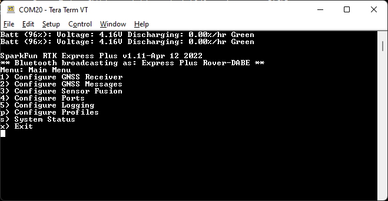

# Configure with Serial

Surveyor:  / Express:  / Express Plus:  / Facet:  / Facet L-Band:  / Reference Station: 

**Note:** Starting with v3.0 of the firmware any serial menu that is shown can also be accessed over Bluetooth. This makes any configuration of a device much easier in the field. Please see [Configure With Bluetooth](configure_with_bluetooth.md) for more information.

To configure an RTK device using serial attach a [USB C cable](https://www.sparkfun.com/products/15425) to the device. The device can be on or off.

## RTK Surveyor / Express / Express+

*The SparkFun RTK Surveyor has a variety of connectors*

Connect the USB cable to the connector labeled **Config ESP32**.

Once connected a COM port will enumerate. Open the `Device Manager` in Windows and look under the Ports branch to see what COM port the device is assigned to.

## RTK Facet

Connect the USB cable to the USB connector.

There is a USB hub built into the RTK Facet. When you attach the device to your computer it will enumerate two COM ports.

In the image above, the `USB Serial Device` is the ZED-F9P and the `USB-SERIAL CH340` is the ESP32.

**Don't See 'USB-Serial CH340'?** If you've never connected a CH340 device to your computer before, you may need to install drivers for the USB-to-serial converter. Check out our section on <a href="https://learn.sparkfun.com/tutorials/sparkfun-serial-basic-ch340c-hookup-guide#drivers-if-you-need-them">"How to Install CH340 Drivers"</a> for help with the installation.

**Don't See 'USB Serial Device'?** The first time a u-blox module is connected to a computer you may need to adjust the COM driver. Check out our section on <a href="https://learn.sparkfun.com/tutorials/getting-started-with-u-center-for-u-blox#install-drivers">"How to Install u-blox Drivers"</a> for help with the installation.

Configuring the RTK device is done over the *USB-Serial CH340* COM port via the serial text menu. Various debug messages are printed to this port at 115200bps and a serial menu can be opened to configure advanced settings. 

Configuring the ZED-F9P is done over the *USB Serial Device* port using [u-center](https://learn.sparkfun.com/tutorials/getting-started-with-u-center-for-u-blox/all). It’s not necessary for normal operation but is handy for tailoring the receiver to specific applications. As an added perk, the ZED-F9P can be detected automatically by some mobile phones and tablets. If desired, the receiver can be directly connected to a compatible phone or tablet removing the need for a Bluetooth connection.

## Terminal Window

Open a terminal window at 115200bps; you should see various status messages every second. Press any key to open the configuration menu. Not sure how to use a terminal? Check out our [Serial Terminal Basics](https://learn.sparkfun.com/tutorials/terminal-basics) tutorial. 

Note that some Windows terminal programs (e.g. Tera Term) may reboot the Facet when the terminal connection is closed. You can disconnect the USB cable first to prevent this from happening.

*Main Menu*

Pressing any button will display the Main menu. The Main menu will display the current firmware version and the Bluetooth broadcast name. Note: When powered on, the RTK device will broadcast itself as either *[Platform] Rover-XXXX* or *[Platform] Base-XXXX* depending on which state it is in. The Platform is 'Facet', 'Express', 'Surveyor', etc.

Pressing '1' or 's' for example, will open those submenus.

The menus will timeout after 10 minutes of inactivity, so if you do not press a key the device will exit the menu and return to reporting status messages.

*Configuration menu via Bluetooth*

**Note:** Starting with firmware v3.0, Bluetooth-based configuration is supported. Please see [Configure With Bluetooth](configure_with_bluetooth.md) for more information.

## System Report

Sending the `~` character to the device over the serial port will trigger a system status report. This is a custom NMEA-style sentence, complete with CRC.

*Terminal showing System Status*

Below is an example system status report sentence:

> $GNTXT,01,01,05,202447.00,270522,0.380,29,40.090355193,-105.184764700,1560.56,3,0,86*71

* $GNTXT : Start of custom NMEA sentence
* 01 : Number of sentences
* 01 : Sentence number
* 05 : Sentence type ID (5 is for System Status messages)
* 202447.00 : Current hour, minute, second, milliseconds
* 270522 : Current day, month, year
* 0.380 : Current horizontal positional accuracy (m)
* 29 : Satellites in view
* 40.090355193 : Latitude
* -105.184764700 : Longitude
* 1560.56 : Altitude
* 3 : Fix type (0 = no fix, 2 = 2D fix, 3 = 3D fix, 4 = 3D + Dead Reackoning, 5 = Time)
* 0 : Carrier solution (0 = No RTK, 1 = RTK Float, 2 = RTK Fix)
* 86 : Battery level (% remaining)
* *71 : The completion of the sentence and a [CRC](http://engineeringnotes.blogspot.com/2015/02/generate-crc-for-nmea-strings-arduino.html)

**Note:** This is a custom NMEA sentence, can vary in length, and may exceed the [maximum permitted sentence length](https://www.nmea.org/Assets/20160520%20txt%20amendment.pdf) of 61 characters.