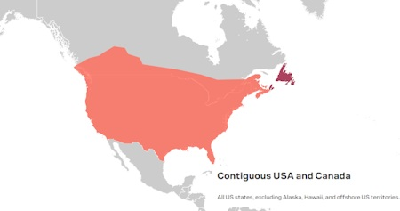

# Correction Sources

Surveyor:  / Express:  / Express Plus:  / Facet:  / Facet L-Band:  / Reference Station: 

To achieve an RTK Fix, SparkFun RTK products must be provided with a correction source. This correction data, sometimes called RTCM (see [What is RTCM?](https://learn.sparkfun.com/tutorials/what-is-gps-rtk/all#what-is-rtcm)), can be produced from a variety of sources.

* [Paid Services](correction_sources.md#paid-services)
* [Government Provided Corrections](correction_sources.md#government-provided-corrections)
* [Permanent Base](correction_sources.md#permanent-base)

**Note:** The RTK Facet L-Band is capable of receiving RTCM corrections from a terrestrial source but because it has a built-in L-Band receiver, we recommend using the satellite-based corrections.

## Paid Services

These services cover entire countries and regions but charge a monthly fee. Easy to use, but the most expensive.

* [PointOneNav](https://app.pointonenav.com/trial?src=sparkfun) ($50/month) - US, EU
* [Onocoy](https://console.onocoy.com/explorer) ($25/month) - US, EU, Australia, and many other partial areas
* [Skylark](https://www.swiftnav.com/skylark) ($29 to $69/month) - US, EU, Japan, Australia
* [SensorCloud RTK](https://rtk.sensorcloud.com/pricing/) ($100/month) partial US, EU
* [Premium Positioning](https://www.premium-positioning.com) (~$315/month) partial EU
* [KeyNetGPS](https://www.keypre.com/KeynetGPS) ($375/month) North Eastern US
* [Hexagon/Leica](https://hxgnsmartnet.com/en-US) ($500/month) - partial US, EU

Using PointOneNav is discussed in the [Quick Start guide](https://docs.sparkfun.com/SparkFun_RTK_Firmware/intro/#ntrip-example). We'll discuss using Skylark below. All services have the same basic interface: as long as the service has NTRIP, the SparkFun RTK product can use it.

**Skylark**

*Skylark Coverage Area*

A company called SwiftNav offers a service called [Skylark](https://www.swiftnav.com/skylark). As of writing, for $29 to $69 per month, you will get corrections covering North America, Europe, and the Asia Pacific. This is a very simple method for obtaining NTRIP corrections.

Upon creating an account, you'll be issued NTRIP credentials that can immediately be used with Lefebure, SW Maps, or any GIS app that supports NTRIP. 

*Entering credentials into SW maps*

The most difficult part of using Skylark for corrections is entering the auto-generated NTRIP Password. While we understand security is important, it's not trivial manually entering these types of credentials into a GIS application.

*SW Maps showing Positional Accuracy*

One downside is that with a 'regional' provider such as Skylark the distance to the correction station may be larger than 10km. While we've always gotten an RTK fix, we often see horizontal positional accuracy of ~30mm instead of the 14mm when using our fixed GNSS reference station. Your mileage may vary.

**PointPerfect**

PointPerfect is a correction service run by u-blox. The service runs about $44 per month and covers the contiguous USA and Europe. Unfortunately, it does not have NTRIP access at the time of writing. Instead, they use an API and encrypted packets in a format called SPARTN. SparkFun uses the PointPerfect service to provide satellite-based corrections to the [RTK Facet L-Band](https://www.sparkfun.com/products/20000). This service works very well for the RTK Facet L-Band, but because no 3rd party GIS software is known to exist that can communicate with PointPerfect, we don't currently recommend using PointPerfect with SW Maps, Lefebure, Field Genius, SurvPC, Survey Master, etc.

## Government Provided Corrections

 

*State Wide Network of Continuously Operating Reference Stations (CORS)*

Be sure to check if your state or country provides corrections for free. Many do! Currently, there are 21 states in the USA that provide this for free as a department of transportation service. Search ‘Wisconsin CORS’ as an example. Similarly, in France, check out [CentipedeRTK](https://docs.centipede.fr/). 

[UNAVCO](https://www.unavco.org/) is a US-based governmental organization that runs a [network of publicly available NTRIP sources](https://www.unavco.org/instrumentation/networks/status/all/realtime). If you're lucky there's a station within 10km (6 miles) of you.

[EUREF](http://www.epncb.oma.be/_networkdata/data_access/real_time/map.php) is a permanent GNSS network in the EU.

There are several public networks across the globe, be sure to google around!

## Permanent Base

*The base station at SparkFun*

A permanent base is a user-owned and operated base station. See [Creating a Permanent Base](permanent_base.md) for more information. A permanent base has the benefit of being the most accurate, with relatively low cost, but requires at least 24 hours of initial logging and some mechanical setup time (attaching the antenna, connecting a device to the internet, etc).

## Temporary Base

*Temporary RTK Express Base setup with serial radio*

A temporary or mobile base setup is handy when you are in the field too far away from a correction source, or if your measurements do not require absolute accuracy. 

To set up a temporary base, a 2nd RTK device is mounted to a tripod and it is configured to complete a survey-in (aka, locate itself). It will then begin broadcasting RTCM correction data. This data (~1000 bytes a second) is sent over a data link to one or multiple rovers that can then obtain RTK Fix. 

Any tripod with a ¼” camera thread will work. The [Amazon Basics tripod](https://www.amazon.com/AmazonBasics-Lightweight-Camera-Mount-Tripod/dp/B00XI87KV8) works well enough but is a bit lightweight and rickety. 

For RTK products with an external antenna (ie, RTK Surveyor, RTK Express, RTK Express Plus) a cell phone holder is clamped to the tripod and the RTK device is held in the clamp. The ¼” camera thread is [adapted to ⅝” 11-TPI](https://www.sparkfun.com/products/17546) and an [L1/L2 antenna](https://www.sparkfun.com/products/17751) is attached. A [Male TNC to Male SMA adapter](https://www.sparkfun.com/products/17833) connects the antenna to the RTK device.

Any of the RTK Products (excluding the RTK Express Plus) can be set up to operate in **Base** mode. Once the base has been set up with a clear view of the sky, turn on the RTK device.

On the RTK Surveyor, toggle the *Setup* switch to **BASE**. The device will then enter either 'Fixed' or 'Survey-In' type **Base** mode depending on the system configuration. If the type has been set to Survey-In, the red BASE LED will blink while a survey-in is active. Once complete, the LED will turn solid red and begin transmitting RTCM out the **RADIO** port.

*RTK device in Survey-In Mode*

On the RTK Facet, RTK Facet L-Band, and RTK Express press the **SETUP** button until *Base* is illuminated then stop pressing the Setup button. The device will then enter either 'Fixed' or 'Survey-In' type **Base** mode depending on the system configuration. If the type has been set to Survey-In, the display will show the Survey-In screen.

*Note:* Base mode is not possible on the RTK Express Plus.

*External Serial Radio attached to the back of the RTK Express*

Once the survey is complete the device will begin producing RTCM correction data. If you are using a serial radio, data should start flowing across the link. RTK devices are designed to follow the u-blox recommended survey-in of 60 seconds and a mean 3D standard deviation of 5m of all fixes. If a survey fails to achieve these requirements it will auto-restart after 10 minutes.

More expensive surveyor bases have a ⅝” 11-TPI thread but the top of the surveyor base will often interfere with the antenna’s TNC connector. If you chose to use a surveyor’s ‘stick’ (often called a Prism Pole) be sure to obtain an extension to raise the antenna at least an inch.

If you’re shopping for a cell phone clamp be sure to get one that is compatible with the diameter of your tripod and has a knob to increase clamp pressure. Our tripod is 18mm in diameter and we’ve had a good experience with [this clamp](https://www.amazon.com/gp/product/B072DSRF3J). Your mileage may vary.

Note: A mobile base station works well for quick trips to the field. However, the survey-in method is not recommended for the highest accuracy measurements because the positional accuracy of the base will directly translate to the accuracy of the rover. Said differently, if your base's calculated position is off by 100cm, so will every reading your rover makes. For many applications, such as surveying, this is acceptable since the Surveyor may only be concerned with measuring the lengths of property lines or features. If you’re looking for maximum accuracy consider installing a [permanent static base with a fixed antenna](permanent_base.md). We were able to pinpoint the antenna on the top of SparkFun with an incredible accuracy [+/-2mm of accuracy](img/Corrections/SparkFun_PPP_Results.png) using PPP!

## Other Sources

There are a large number of networks run throughout the world. Be sure to dig a bit to find a local correction source near you.

* RTK2go offers a [list](http://monitor.use-snip.com/?hostUrl=rtk2go.com&port=2101) and map (click 'View all' from the list) of stations using their public casting service. While none of these stations have been verified as accurate, it can be a decent starting point to do a 'quick' test of your system.