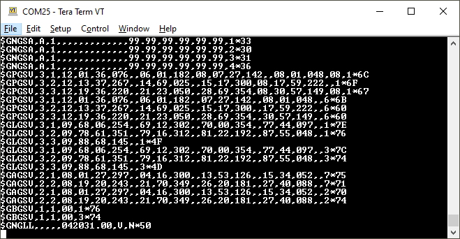

# Output to an Embedded System

Surveyor:  / Express:  / Express Plus:  / Facet:  / Facet L-Band:  / Reference Station: 

Many applications using the RTK products will use a 3rd party GIS application or mobile app like SW Maps and receive the data over Bluetooth. Alternatively, for embedded applications, a user can obtain the NMEA data over serial directly.

For this example, we will connect the output from the **Data** port to a [USB to Serial adapter](https://www.sparkfun.com/products/15096) so that we can view the serial data over a terminal connection.

The **Data** port on the RTK Facet, Express, and Express Plus can be configured to output a variety of different signals including NMEA Serial data. Be sure to check out the [Ports Menu](menu_ports.md) section to be sure your device is configured to output NMEA.

Connect the included [4-pin JST to breadboard cable](https://www.sparkfun.com/products/17240) to the **Data** port. The cable has the following pinout:

* **Red** - 3.3V
* **Green** - TX (output from the RTK device)
* **Orange** - RX (input into the RTK device)
* **Black** - GND

[Open a terminal](https://learn.sparkfun.com/tutorials/terminal-basics) at 115200bps and you should see NMEA sentences:

The Data connector on all RTK products is a 4-pin locking 1.25mm JST SMD connector (part#: SM04B-GHS-TB, mating connector part#: GHR-04V-S). **3.3V** is provided by this connector to power a remote device if needed. While the port is capable of sourcing up to 600mA, we do not recommend more than 300mA. This port should not be connected to a power source, so if your embedded device has its own power do not connect the red wire.

**Warning!** All data in and out of RTK products is **3.3V**. Exposing these pins to **5V** or higher voltage logic will damage the device.

The parsing of NMEA sentences is straightforward and left to the reader. There are ample NMEA parsing libraries available in C++, Arduino, Python, and many more languages.

## Reference Station

The Reference Station provides direct access to the u-blox GNSS TX and RX signals via the 3.5mm screw terminal I/O header:

* TX2 : u-blox ZED-F9P UART2 transmit: 3.3V OUTPUT
  
* RX2 : u-blox ZED-F9P UART2 receive: 3.3V INPUT

Please see the [Reference Station Hookup Guide](https://learn.sparkfun.com/tutorials/sparkfun-rtk-reference-station-hookup-guide#hardware-overview) for more details.