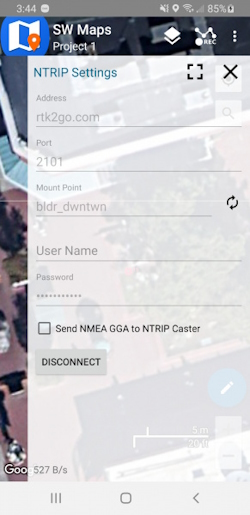

# Android

Surveyor:  / Express:  / Express Plus:  / Facet:  / Facet L-Band:  / Reference Station: 

While we recommend [SW Maps for Android](gis_software_android/#sw-maps), there are a variety of 3rd party apps available for GIS and surveying for [Android](gis_software_android.md), [iOS](gis_software_ios.md), and [Windows](gis_software_windows.md). We will cover a few examples below that should give you an idea of how to get the incoming NMEA data into the software of your choice.

## ArcGIS Field Maps

[ArcGIS Field Maps](https://play.google.com/store/apps/details?id=com.esri.fieldmaps&hl=en_US) by Esri is a popular GIS app. Unfortunately it does not have a built in NTRIP Client to allow high precision corrections down to the RTK device. To enable high-precision, a [mock location](connecting_bluetooth.md/#enable-mock-location) and an intermediary app such as [GNSS Master](gis_software_android.md/#gnss-master) or [Lefebure](gis_software_android.md/#lefebure) is needed.

Once a [mock location](connecting_bluetooth.md/#enable-mock-location) provider is setup, open Field Maps.

Select **World Imagery**.

*ArcGIS Field Maps with 12mm accuracy*

Field Maps will use the device's internal location as its default location provider. With GNSS Master or Lefebure providing the mock location to the phone, Field Maps will have a super precise GNSS location and data collection can begin.

## ArcGIS QuickCapture

[ArcGIS QuickCapture](https://play.google.com/store/apps/details?id=com.esri.arcgisquickcapture&hl=en_US) by Esri is a popular GIS app. Unfortunately it does not allow Bluetooth connections to 3rd party RTK devices. To enable a connection to a SparkFun RTK device, a [mock location](connecting_bluetooth.md/#enable-mock-location) and an intermediary app such as [GNSS Master](gis_software_android.md/#gnss-master) or [Lefebure](gis_software_android.md/#lefebure) is needed.

Once a [mock location](connecting_bluetooth.md/#enable-mock-location) provider is setup, open QuickCapture.

For the purposes of this demonstration, click *Continue without signing in*.

Select the **+** then **Browse Projects**.

Select a project.

From the BioBlitz project screen we can see we have a GPS accuracy of less than 1 ft. The RTK device has RTK fix and is providing extremely accurate (better than 20mm or 1") positional data.

Click the map icon in the upper right.

The location of the receiver is shown on a map. With GNSS Master or Lefebure providing the mock location to the phone, QuickCapture will have a very precise GNSS location and data collection can begin.

## ArcGIS Survey123

[ArcGIS Survey123](https://play.google.com/store/apps/details?id=com.esri.survey123&hl=en_US) by Esri is a popular GIS app. Unfortunately it does not allow Bluetooth connections to 3rd party RTK devices. To enable a connection to a SparkFun RTK device, a [mock location](connecting_bluetooth.md/#enable-mock-location) and an intermediary app such as [GNSS Master](gis_software_android.md/#gnss-master) or [Lefebure](gis_software_android.md/#lefebure) is needed.

Once a [mock location](connecting_bluetooth.md/#enable-mock-location) provider is setup, open Survey123.

For the purposes of this demonstration, click *Continue without signing in*.

Select the satellite icon in the upper right corner.

If the mock location provider app is running, you should see the Lat/Lon/Alt from the RTK device. In the above image, RTK Fix is achieved with 0.033ft (10mm) accuracy. Click on the map icon.

The location of the receiver is shown on a map. With GNSS Master or Lefebure providing the mock location to the phone, Survey123 will have a very precise GNSS location and data collection can begin.

## Diamond Maps

[Diamond Maps](https://diamondmaps.com/) is a great solution for utilities and municipalities. $20/month GIS software with many great features. Get the Android app [here](https://play.google.com/store/apps/details?id=com.diamondmaps.OfflineApp&hl=en_US).

Be sure your device is [paired over Bluetooth](connecting_bluetooth.md#android).

From the Home Screen, click on the 'hamburger' settings button in the top left corner.

Select **GPS Status**.

Click on the **Select a GPS Source** box and select the RTK device that was previously paired with.

Once a receiver is selected, its status will be shown in the GPS Setup window. Additionally, an NTRIP Client is available for corrections.

**NTRIP Client**

If you’re using a serial radio to connect a Base to a Rover for your correction data, or if you're using the RTK Facet L-Band with built-in corrections, you can skip this part.

From this window, an NTRIP Client can be configured. Enter your NTRIP Caster information then click on **START**. Click *Close* to exit out to the main window.

*0.03ft accuracy shown in green*

Closing the GPS Source window will show the map as well as the relative accuracy in feet. 

## Field Genius

[Field Genius for Android](https://www.microsurvey.com/products/fieldgenius-for-android/) is another good solution, albeit a lot more expensive than free. 

Be sure your device is [paired over Bluetooth](connecting_bluetooth.md#android).

From the Main Menu open `Select Instrument`.

Click the 'Add Profile' button.

Click `GNSS Rover` and select *NMEA* as the Make. Set your Profile Name to something memorable like 'RTK-Express' then click the 'Create' button.

Click on 'SET UP COMMUNICATION'.

From the Bluetooth communication page, click the 'Search' button.

You will be shown a list of paired devices. Select the RTK device you'd like to connect to then click 'Connect'. The RTK device will connect and the MAC address shown on the RTK device OLED will change to the Bluetooth icon indicating a link is open.

**NTRIP Client**

If you’re using a serial radio to connect a Base to a Rover for your correction data, or if you're using the RTK Facet L-Band with built-in corrections, you can skip this part.

We need to send RTCM correction data from the phone back to the RTK device so that it can improve its fix accuracy. Your phone can be the radio link! Click on 'SET UP CORRECTIONS'.

Click on 'RTK via Internet' then 'SET UP INTERNET', then 'Done'.

Click on 'SET UP DATA SOURCE'.

Click 'Add New Source'.

Enter your NTRIP Caster credentials and click 'DONE'. 

What's an NTRIP Caster? In a nutshell, it's a server that is sending out correction data every second. There are thousands of sites around the globe that calculate the perturbations in the ionosphere and troposphere that decrease the accuracy of GNSS accuracy. Once the inaccuracies are known, correction values are encoded into data packets in the RTCM format. You, the user, don't need to know how to decode or deal with RTCM, you simply need to get RTCM from a source within 10km of your location into the RTK device. The NTRIP client logs into the server (also known as the NTRIP caster) and grabs that data, every second, and sends it over Bluetooth to the RTK device.

Don't have access to an NTRIP Caster? You can use a 2nd RTK product operating in Base mode to provide the correction data. Check out [Creating a Permanent Base](permanent_base.md). If you're the DIY sort, you can create your own low-cost base station using an ESP32 and a ZED-F9P breakout board. Check out [How to Build a DIY GNSS Reference Station](https://learn.sparkfun.com/tutorials/how-to-build-a-diy-gnss-reference-station). If you'd just like a service, [Syklark](https://www.swiftnav.com/skylark) provides RTCM coverage for $49 a month (as of writing) and is extremely easy to set up and use. Remember, you can always use a 2nd RTK device in *Base* mode to provide RTCM correction data but it will be less accurate than a fixed position caster.

Click 'My NTRIP1' then 'Done' and 'Connect'. 

You will then be presented with a list of Mount Points. Select the mount point you'd like to use then click 'Select' then 'Confirm'.

Select 'Done' then from the main menu select 'Survey' to begin using the device.

Now you can begin using the SparkFun RTK device with Field Genius.

## GNSS Master

[GNSS Master](https://play.google.com/store/apps/details?id=com.gnssmaster&hl=en_US) is a great utility when a given GIS app does not have an NTRIP Client or a way to connect over Bluetooth. GNSS Master connects to a RTK device over Bluetooth (or Bluetooth BLE) as well as any correction source (NTRIP, PointPerfect, even USB Serial), and then acts as the phone's location using [Mock Location](connecting_bluetooth.md/#enable-mock-location).

**Note:** Most GIS apps will not need GNSS Master or Mock Location enabled and this section can be skipped.

Read how to [Enable Mock Location](connecting_bluetooth.md/#enable-mock-location).

From the GNSS Master main screen, select **GNSS Receiver Connection**.

Pick the RTK device to connect to from the list, then click *Connect*. The **Data Rate** should increase indicating data flowing from the RTK device to the GNSS Master app. Click the back button to return to the main screen.

Select **Correction Input** to setup an NTRIP Client.

This is one of the powerful features of GNSS Master - multiple connections can be entered. This is helpful if you regularly switch between locations or NTRIP Casters and your GIS software only allows entry of a single NTRIP source. GNSS Master supports corrections from NTRIP Casters but also PointPerfect and a direct serial connection to a GNSS receiver. This can be really helpful in advanced setups.

Enter your NTRIP Client information then click **SAVE**.

Once connected the *Data Rate* should increase above 0 bytes per second.  Return to the home screen by hitting the back button.

Enable mock location. If GNSS Master throws an error, re-enable GNSS Master as your [Mock Location provider](connecting_bluetooth.md/#enable-mock-location) in Developer Options.

Once enabled, any GIS app that selects 'Internal' or 'Phone Location' as its source will instead be fed the high precision NMEA being generated by the RTK device connected over Bluetooth.

## Lefebure 

[Lefebure NTRIP Client](https://play.google.com/store/apps/details?id=com.lefebure.ntripclient&hl=en_US) is the *original* app for getting correction from an NTRIP caster and down over Bluetooth. It's an oldie but a goodie.

**Note:** Most GIS apps will not need Lefebure or Mock Location enabled and this section can be skipped.

The problem is that if Lefebure is connected to the RTK device providing RTCM corrections over Bluetooth, then other GIS applications cannot use the same Bluetooth connection at the same time. That's where mock locations save the day. Lefebure can be setup to take over or 'mock' the GPS location being reported by the phone. Nearly all GIS apps can use the phone's GPS location. So if the phone's location is magically super precise, then Lefebure can be the NTRIP Client and data provide, and your GIS app is none the wiser, and uses the phone's location.

Read how to [Enable Mock Location](connecting_bluetooth.md/#enable-mock-location).

Once mock locations are enabled, click on the *Settings* gear in the top left corner.

If needed, an NTRIP Client can be setup to provide corrections over Bluetooth to the RTK device.

Enter the Caster information and hit the back button.

Select *Receiver Settings*.

Select the RTK device that has been paired over Bluetooth. Also enable Mock Locations. Hit the back button to return to the main screen.

Press the **Connect** button. The app will connect to the NTRIP Caster. Now, any GIS app that selects 'Internal' or 'Phone Location' as its source will instead be fed the high precision NMEA being generated by the RTK device connected over Bluetooth.

## QField

[QField](https://docs.qfield.org/get-started/) is a free GIS Android app that runs QGIS.

*The 'Reset to Surveying Defaults' button*

First, configure the RTK device to output *only* NMEA messages. QField currently does not correctly parse other messages such as RAWX or RTCM so these will interfere with communication if they are enabled.

These RTK device settings can be found under the [Messages menu](menu_messages.md) through the [WiFi config page](configure_with_wifi.md) or through the [Serial Config menu](configure_with_serial.md).

Create an account and project on [QFieldCloud](https://qfield.cloud/). This project will be synchronized and viewable on the QField app.

*Refresh Projects button*

Once the project is created, press the Refresh projects list button to update the list. Then select your project.

*'Hamburger' menu in upper right corner*

Press the icon in the top left corner of the app to open the project settings.

*Project settings*

From the project settings menu, press the gear icon to open the device settings dropdown menu.

*Project settings submenu*

From the submenu, select 'Settings'.

*Positioning Menu*

Select the Positioning Menu. Then, with your RTK device on and in normal mode (not AP Config) press the Scan button in the QField app to update the dropdown list of available Bluetooth devices. If your device is not detected, be sure you've [paired your cellphone or laptop with Bluetooth](connecting_bluetooth.md).

Once connected exit out of the menus and see position information within your project.

## Survey Master

[Survey Master](https://www.comnavtech.com/companyfile/4/) by ComNam / SinoGNSS is an Android-based option. The download location can vary so google 'Survey Master ComNav Download' if the link above fails. Download the zip file, send the APK file to a phone and install the program.

By default, a wizard will guide you through the setup. The Project step will ask you for the name of the project, the datum, etc. 

Next select your connection. 

For the Device Model select 'NMEA Device'. 

If you are just getting started, use one of the default antenna types. If you are attempting to get sub-centimeter accuracy, enter the parameters of your antenna and add it. Above are the NGS-certified parameters for the [TOP106 antenna](https://www.sparkfun.com/products/17751).

Click the 'Target Device' option to get a list of available Bluetooth devices. Make sure your RTK product is on and you should see the device. In this example 'Express Rover-B022' was chosen.

To finish, click 'Connect'. You should see the Bluetooth MAC address on your RTK product change to the Bluetooth icon indicating a connection is established.

Next is configuring the 'Work mode' of the device. The step is where we set up our NTRIP correction source.

Click 'Add' to create a new work mode.

Shown above, we configure the NTRIP Client. Survey Master calls this the 'SinoGNSS' Protocol. Click on the three bars to the right of 'Server' to enter a new NTRIP connection.

Here you can add different NTRIP Caster providers. If you're using RTK2Go be sure to enter your contact email into the user name.

Return to the 'Datalink type' window and select the Server you just entered. Re-enter the server address and port for your NTRIP Caster. Once complete, click on the down-pointing arrow. This will ping the Caster and obtain the mount point table. Select your mount point.

Select the newly created work mode and press the 'Apply' button.

Survey Master will attempt to connect to your specified RTK corrections source (NTRIP Caster). Upon success, you will be located on the Project menu.

Survey Master expects many more NMEA sentences than most GIS software. We must enable some additional messages on the RTK device to correctly communicate with Survey Master. 

Note above: There are 9 enabled messages and GSV is set to '1'.

Connect to the RTK device either over [WiFi AP config](/configure_with_wifi/) or via [Serial](/configure_with_serial/). Above is shown the serial method.

Open a terminal at 115200bps and press a key to open the serial configuration menu. Press '2' for GNSS Messages, press '1' for NMEA messages, now be sure to enable 9 messages to a rate of 1:

* GGA
* GLL
* GRS
* GSA
* GST
* GSV
* RMC
* VTG
* ZDA

Once complete, press x until you exit the serial menus. Now we may return to Survey Master.

Click on the 'Survey' menu and then 'Topo Survey'. Above we can see a device with RTK float, and 117mm horizontal positional accuracy.

Known Issues:

* Survey Master parses the GxGSV sentence improperly and will only indicate GPS satellites even though the fix solution is using all satellites.

To verify the NMEA sentences are being delivered correctly, Survey Master has a built-in tool. Select the Device->Rover->More->'H-Terminal'. 

## SurPad

[SurPad](https://surpadapp.com/) is an Android app available as a free trial for 30-days. It's loaded as an APK (rather than through Google Play).

Be sure your RTK device has been [paired over Bluetooth](connecting_bluetooth.md#android) to your phone.

*SurPad Home Screen*

Create a project and get to the home screen. Shown above, click on the GNSS receiver icon.

*SurPad connecting over Bluetooth*

Set the **Device manufacturer** to *Other*, **Device type** to *RTK(NMEA0183)*, and **Communication Mode** to *Bluetooth*. Select the SparkFun RTK device that you would like to connect to on the **Paired Devices** list and then click *Connect*.

Once connected to the device a *Debug* button will appear. This is one of the nice features of SurPad: Running debug will allow you to inspect the NMEA coming across the link.

Once done, press the back arrow (top left corner) to return to the home screen. 

*SurPad Point Survey map*

Above: From the home screen press the **Survey** button at the bottom, then **Point Survey** to bring up the map.

In the top left corner, press the green hamburger + cell phone icon. This will open the NTRIP settings.

*SurPad Data Link NTRIP Configuration*

Change the **Connect Mode** from *TCP Client* to *NTRIP*. If you are unable to edit or change the **Connect Mode** from TCP Client be sure the TCP Client is stopped by pressing the *Stop* button in the lower left corner (located in the same spot as the highlighted *Start*).

*SurPad NTRIP Connection*

Enter the information for your NTRIP caster. In the above example, we are connected to the SparkFun base station on RTK2Go. For RTK2Go you will need to enter a valid email address for a user name but a password is not required.

Click on *Start* and you should see the 'Receive data' progress bar (highlighted above) increase each second indicating a connection. Once complete, press 'Apply' to return to the map.

*SurPad with RTK Fix*

Above: After a few moments, the RTK device should move to RTK Float, then RTK Fix. You can see the age of the RTCM data in the upper bar, along with the horizontal (23mm) and vertical (31mm) accuracy estimates. Now you can begin taking points.

## SurvPC

Be sure your device is [paired over Bluetooth](connecting_bluetooth.md#windows).

*Equip Sub Menu*

Select the *Equip* sub menu then `GPS Rover`

*Select NMEA GPS Receiver*

From the drop down, select `NMEA GPS Receiver`.

*Select Model: DGPS*

Select DGPS if you'd like to connect to an NTRIP Caster. If you are using the RTK Facet L-Band, or do not need RTK fix type precision, leave the model as Generic.

*Bluetooth Settings Button*

From the `Comms` submenu, click the Blueooth settings button.

*SurvPC Bluetooth Devices*

Click `Find Device`.

*List of Paired Bluetooth Devices*

You will be shown a list of devices that have been paired. Select the RTK device you want to connect to.

*Connect to Device*

Click the `Connect Bluetooth` button, shown in red in the top right corner. The software will begin a connection to the RTK device. You'll see the MAC address on the RTK device changes to the Bluetooth icon indicating it's connected. 

If SurvPC detects NMEA, it will report a successful connection.

*Receiver Submenu*

You are welcome to enter the ARP (antenna reference point) and surveying stick length for your particular setup.

**NTRIP Client**

Note: If you are using a radio to connect Base to Rover, or if you are using the RTK Facet L-Band you do not need to set up NTRIP; the device will achieve RTK fixes and output extremely accurate location data by itself. But if L-Band corrections are not available, or you are not using a radio link, the NTRIP Client can provide corrections to this Rover.

*RTK Submenu*

If you selected 'DGPS' as the Model type, the RTK submenu will be shown. This is where you give the details about your NTRIP Caster such as your mount point, user name/pw, etc. For more information about creating your own NTRIP mount point please see [Creating a Permanent Base](permanent_base.md)

Enter your NTRIP Caster credentials and click connect. You will see bytes begin to transfer from your phone to the RTK device. Within a few seconds, the RTK device will go from ~300mm accuracy to 14mm. Pretty nifty, no?

What's an NTRIP Caster? In a nutshell, it's a server that is sending out correction data every second. There are thousands of sites around the globe that calculate the perturbations in the ionosphere and troposphere that decrease the accuracy of GNSS accuracy. Once the inaccuracies are known, correction values are encoded into data packets in the RTCM format. You, the user, don't need to know how to decode or deal with RTCM, you simply need to get RTCM from a source within 10km of your location into the RTK device. The NTRIP client logs into the server (also known as the NTRIP caster) and grabs that data, every second, and sends it over Bluetooth to the RTK device.

Don't have access to an NTRIP Caster? You can use a 2nd RTK product operating in Base mode to provide the correction data. Checkout [Creating a Permanent Base](permanent_base.md). If you're the DIY sort, you can create your own low-cost base station using an ESP32 and a ZED-F9P breakout board. Check out [How to](https://learn.sparkfun.com/tutorials/how-to-build-a-diy-gnss-reference-station) Build a DIY GNSS Reference Station](https://learn.sparkfun.com/tutorials/how-to-build-a-diy-gnss-reference-station). If you'd just like a service, [Syklark](https://www.swiftnav.com/skylark) provides RTCM coverage for $49 a month (as of writing) and is extremely easy to set up and use. Remember, you can always use a 2nd RTK device in *Base* mode to provide RTCM correction data but it will be less accurate than a fixed position caster.

Once everything is connected up, click the Green check in the top right corner.

*Storing Points*

Now that we have a connection, you can use the device, as usual, storing points and calculating distances.

*SurvPC Skyplot*

Opening the Skyplot will allow you to see your GNSS details in real-time.

If you are a big fan of SurvPC please contact your sales rep and ask them to include SparkFun products in their Manufacturer drop-down list.

## SW Maps

The best mobile app that we’ve found is the powerful, free, and easy-to-use [SW Maps](https://play.google.com/store/apps/details?id=np.com.softwel.swmaps) by Softwel. It is compatible with Android and iOS, either phone or tablet with Bluetooth. What makes SW Maps truly powerful is its built-in NTRIP client. This is a fancy way of saying that we’ll be showing you how to get RTCM correction data over the cellular network. 

Be sure your device is [paired over Bluetooth](connecting_bluetooth.md#android).

*List of available Bluetooth devices*

From SW Map's main menu, select *Bluetooth GNSS*. This will display a list of available Bluetooth devices. Select the Rover or Base you just paired with. If you are taking height measurements (altitude) in addition to position (lat/long) be sure to enter the height of your antenna off the ground including any [ARP offsets](https://geodesy.noaa.gov/ANTCAL/FAQ.xhtml#faq4) of your antenna (this should be printed on the side).

Click on 'CONNECT' to open a Bluetooth connection. Assuming this process takes a few seconds, you should immediately have a location fix.

*SW Maps with RTK Fix*

You can open the GNSS Status sub-menu to view the current data.

**NTRIP Client**

If you’re using a serial radio to connect a Base to a Rover for your correction data, or if you're using the RTK Facet L-Band with built-in corrections, you can skip this part.

We need to send RTCM correction data from the phone back to the RTK device so that it can improve its fix accuracy. This is the amazing power of the SparkFun RTK products and SW Maps. Your phone can be the radio link! From the main SW Maps menu select NTRIP Client. Not there? Be sure the 'SparkFun RTK' instrument was automatically selected connecting. Disconnect and change the instrument to 'SparkFun RTK' to enable the NTRIP Connection option.

*NTRIP Connection - Not there? Be sure to select 'SparkFun RTK' was selected as the instrument*

*Connecting to an NTRIP Caster*

Enter your NTRIP Caster credentials and click connect. You will see bytes begin to transfer from your phone to the RTK device. Within a few seconds, the RTK device will go from ~300mm accuracy to 14mm. Pretty nifty, no?

Once you have a full RTK fix you'll notice the location bubble in SW Maps turns green. Just for fun, rock your rover monopole back and forth on a fixed point. You'll see your location accurately reflected in SW Maps. Millimeter location precision is a truly staggering thing.

## Vespucci

[Vespucci](https://play.google.com/store/apps/details?id=de.blau.android&hl=en_US&gl=US) is an Open Street Map editor for Android.

This software requires the RTK device to connect over TCP. Be sure you have a local WiFi network entered into the [WiFi Config menu](menu_wifi.md), have a TCP Client or Server enabled, and have noted the TCP port (it's 2947 by default).

With a map open, select the gear icon on the bottom bar.

From the Preferences menu, scroll to the bottom and select 'Advanced Preferences'.

Select **Location settings**.

Select **GPS/GNSS source**. Select **NMEA from TCP client**. TCP server is also supported.

Select **NMEA network source**. Enter the IP address and TCP port of the RTK device. The IP address can be found by opening a serial terminal while connected to WiFi (it is reported every few seconds). The TCP port is entered into the [WiFi Config menu](menu_wifi.md).

Close all menus and you should see your location within Vespucci.

## Other GIS Packages

Hopefully, these examples give you an idea of how to connect the RTK product line to most any GIS software. If there is other GIS software that you'd like to see configuration information about, please open an issue on the [RTK Firmware repo](https://github.com/sparkfun/SparkFun_RTK_Everywhere_Firmware/issues) and we'll add it.

## What's an NTRIP Caster? 

In a nutshell, it's a server that is sending out correction data every second. There are thousands of sites around the globe that calculate the perturbations in the ionosphere and troposphere that decrease the accuracy of GNSS accuracy. Once the inaccuracies are known, correction values are encoded into data packets in the RTCM format. You, the user, don't need to know how to decode or deal with RTCM, you simply need to get RTCM from a source within 10km of your location into the RTK device. The NTRIP client logs into the server (also known as the NTRIP caster) and grabs that data, every second, and sends it over Bluetooth to the RTK device.

## Where do I get RTK Corrections?

Be sure to see [Correction Sources](correction_sources.md). 

Don't have access to an NTRIP Caster or other RTCM correction source? There are a few options.

The [SparkFun RTK Facet L-Band](https://www.sparkfun.com/products/20000) gets corrections via an encrypted signal from geosynchronous satellites. This device gets RTK Fix without the need for a WiFi or cellular connection.

Also, you can use a 2nd RTK product operating in Base mode to provide the correction data. Check out [Creating a Permanent Base](permanent_base.md). 

If you're the DIY sort, you can create your own low-cost base station using an ESP32 and a ZED-F9P breakout board. Check out [How to Build a DIY GNSS Reference Station](https://learn.sparkfun.com/tutorials/how-to-build-a-diy-gnss-reference-station). 

There are services available as well. [Syklark](https://www.swiftnav.com/skylark) provides RTCM coverage for $49 a month (as of writing) and is extremely easy to set up and use. [Point One](https://app.pointonenav.com/trial?utm_source=sparkfun) also offers RTK NTRIP service with a free 14 day trial and easy to use front end.
