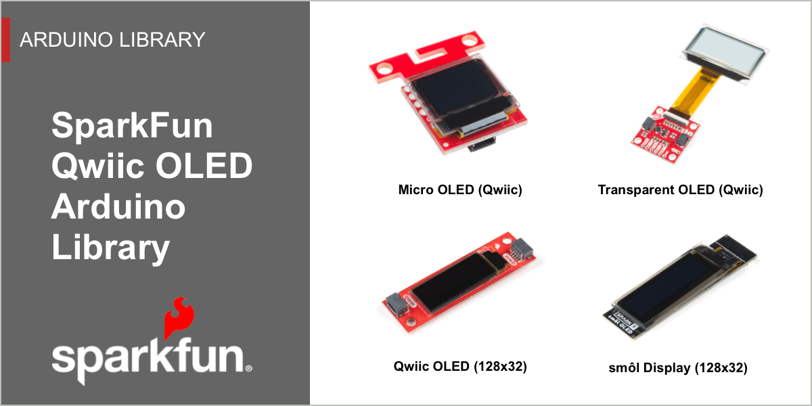

# The Qwiic OLED Arduino Library

The SparkFun Qwiic OLED Arduino Library is a single graphics module that supports all SparkFun OLED boards based on the SSD1306 from Solomon Systech. Prior to this library, three different libraries were used to support our four different OLED boards. 

The SparkFun Qwiic OLED Library delivers a common implementation for all our Qwiic OLED products, delivering a unified, fast, and efficient solution that implements a familiar and easy to understand user experience.

### Key Features
*   Implements common graphics capabilities: pixel, line, rectangle, filled rectangle, circle, filled circle, bitmap, text and raster operators (i.e. XOR).
* Smart data transfer to the device – only sends _dirty_ regions of the graphics buffer to the OLED device, not the entire buffer. 
* High performance – 2x faster than our previous OLED library, often much higher. 
* Efficient memory usage. No dynamic memory utilized. Static resources are loaded once, and only on explicit declaration. 
* Implements a familiar interface, making migration from older libraries straight forward

### Getting Started

The [Getting Started Page](software.md) outlines library installation and the general use of the qwiic OLED library. 

Detailed examples are included as part of the library installation process and available in the Arduino IDE `File > Examples >` menu. A walk-thru of key examples is contained in the [Examples](sparkfun-qwiic-oled-arduino-library-examples/ex_01_hello/) section of this documentation set. 

A full [API Reference](api_device.md) is also provided for the library.

### Supported Products

The SparkFun Qwiic OLED Arduino Library supports the following SparFun Products

<table class="table table-hover table-striped table-bordered">
    <tr>
        <td width="120" pad=10 style="vertical-align: middle;">
            </td>
         <td style="text-align:left; vertical-align: middle; padding-left: 20px;font-weight: bold;">
            <a href="https://www.sparkfun.com/products/14532">SparkFun Micro OLED Breakout (Qwiic)</a>
        </td>
    </tr>
    <tr>
        <td width="120" pad=10 style="vertical-align: middle;">
            </td>
         <td style="text-align:left; vertical-align: middle; padding-left: 20px;font-weight: bold;">
           <a href="https://www.sparkfun.com/products/17153">SparkFun Qwiic OLED Display (0.91 in, 128x32)</a>
        </td>
    </tr>
    <tr>
        <td width="120" pad=10 style="vertical-align: middle;">
            </td>
         <td style="text-align:left; vertical-align: middle; padding-left: 20px;font-weight: bold;">
           <a href="https://www.sparkfun.com/products/15173">SparkFun Transparent Graphical OLED Breakout (Qwiic)</a>
        </td>
    </tr>
</table>

### Supported Microcontrollers - Arduino Environment

* [Artemis](https://www.sparkfun.com/products/15574)
* [SAMD51](https://www.sparkfun.com/products/14713)
* [ESP32](https://www.sparkfun.com/products/15663)
* [STM32](https://www.sparkfun.com/products/17712)
* [SAMD21](https://www.sparkfun.com/products/14812)
* [nrf5280](https://www.sparkfun.com/products/15025)
* [Teensy](https://www.sparkfun.com/products/16402)
* [ATMega328](https://www.sparkfun.com/products/18158)

### License
The SparkFun Qwiic OLED Arduino Library is licensed using the Open Source MIT License