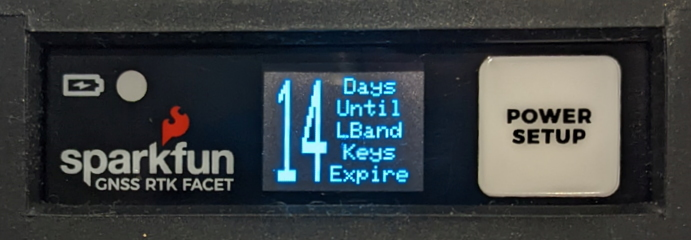
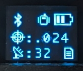

# PointPerfect Menu

Surveyor:  / Express:  / Express Plus:  / Facet:  / Facet L-Band:  / Reference Station: 

**Note:** This section only applies to RTK Facet *L-Band* products. Regular RTK Facet, Surveyor, Express, and Express Plus products do not have L-Band antennas or receivers built-in.

*Configuring PointPerfect settings over WiFi*

*Configuring PointPerfect settings over serial*

*RTK Facet L-Band* products are equipped with a special antenna and extra receiver to decrypt the L-Band corrections using the PointPerfect service from u-blox. The PointPerfect sub-menu allows a user to enter their 'Home' WiFi settings. This WiFi SSID and password are used to regularly obtain the needed decryption keys from u-blox. This is normally your home WiFi or other accessible WiFi.

PointPerfect L-Band decryption keys are valid for a maximum of 56 days. During that time, the RTK Facet L-Band can operate normally without the need for WiFi access. However, when the keys are set to expire in 28 days or less, the RTK Facet L-Band will attempt to log in to WiFi at each power on. If WiFi is not available, it will continue normal operation. If the keys fully expire, the device will continue to receive the L-Band signal but will be unable to decrypt the signal, disabling high-precision GNSS. The RTK Facet L-Band will continue to have extraordinary accuracy (we've seen better than 0.15m HPA) but not the centimeter-level accuracy that comes with RTK.

**Note:** The RTK Facet L-Band is capable of receiving RTCM corrections over traditional means including NTRIP data over Bluetooth or a serial radio. But the real point of L-Band and PointPerfect is that you can be *anywhere*, without cellular or radio cover, and still enjoy millimeter accuracy.

*Display showing 14 days until keys expire*

The unit will display various messages to aid the user in obtaining keys as needed.

*Three pronged satellite dish indicating L-Band reception*

Upon successful reception and decryption of PointPerfect corrections, the satellite dish icon will increase to a three-pronged icon. As the unit's fix increases the cross-hair will indicate a basic 3D solution, a double blinking cross-hair will indicate a floating RTK solution, and a solid double cross-hair will indicate a fixed RTK solution.

*PointPerfect Menu*

The *Days until keys expire* inform the user how many days the unit has until it needs to connect to WiFi to obtain new keys.

* Option '1' disables the use of PointPerfect corrections.

* Option '2' disables the automatic attempts at WiFi connections when key expiry is less than 28 days.

* Option '3' will trigger an immediate attempt to connect over WiFi and update the keys.

* Option '4' will display the Device ID. This is needed when a SparkFun RTK Facet L-Band product needs to be added to the PointPerfect system. This is normally taken care of when you purchase the L-Band unit with PointPerfect service added, but for customers who wish to extend their subscription beyond the initial year, or did not purchase the service and want to add it at a later date, this Device ID is what customer service needs.

* Option 'k' will bring up the Manual Key Entry menu.

*Manual Key Entry Menu*

Because of the length and complexity of the keys, we do not recommend you manually enter them. This menu is most helpful for displaying the current keys.

Option '1' will allow a user to enter their Device Profile Token. This is the token that is used to provision a device on a PointPerfect account. By default, users may use the SparkFun token but must pay SparkFun for the annual service fee. If an organization would like to administer its own devices, the token can be changed here.

