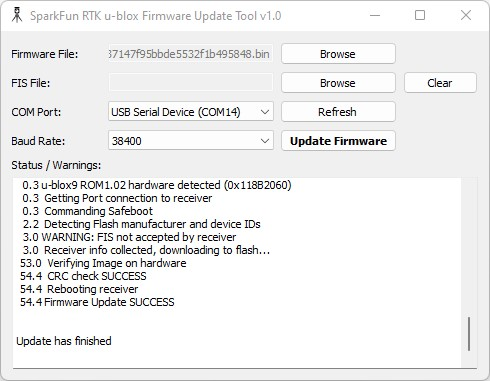
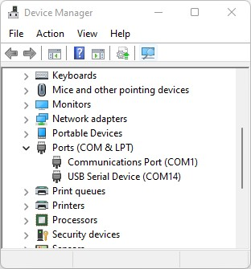

This folder contains the python based GUI for updating the u-blox module firmware.

The code will only run on Windows as it relies upon u-blox's ubxfwupdate.exe.

There is a full, integrated executable available for Windows.

### To Use

* Attach the RTK device's CONFIG UBLOX port to your computer using a USB cable. 
* Turn the RTK device on.
* Open Device Manager to confirm which COM port the device is operating on.

-> *Device Manager showing USB Serial port on COM14* <-

* Get the latest binary firmware file from the *[u-blox](https://www.u-blox.com/en/product/zed-f9p-module?file_category=Firmware%2520Update&legacy=Current)* website.
* Run *RTK_u-blox_Update_GUI.exe* (it takes a few seconds to start)
* Click *Browse* and select the binary file to update
* Select the COM port previously seen in the Device Manager.
* Click *Update Firmware*

Once complete, the u-blox module will restart.
